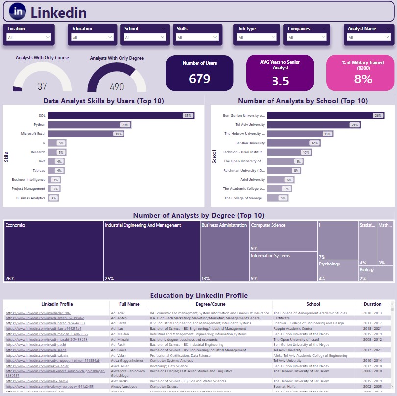
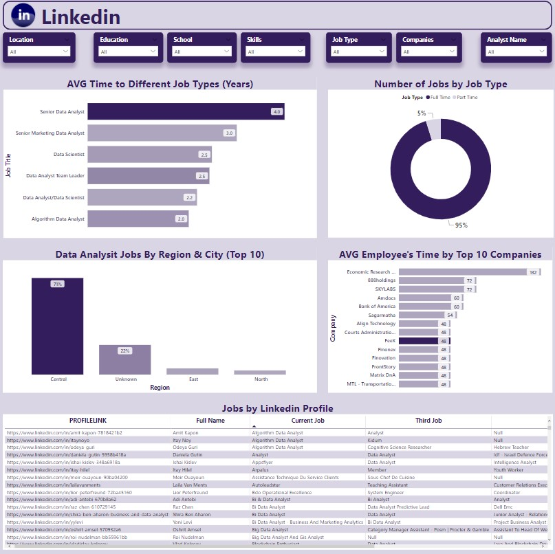

# Project Preview
Linkedin Project

This is one of 5 projects in a volunteer program called "JunDatyst" - a project to help junior data analysts gain professional experience and produce data analysis project.

This is a unique project that analyzes the profession of Data Analyst in Israel on Linkedin's platform.
All the data in this project is real information from profiles of Data Analysts in Israel.
The dataset represents 679 real Data Analyst profiles in Israel witch scraped with c++ scraping tool during Jun 2022 - May 2022.

The project consists :
1) Project Overview & Explanation - PDF
2) Raw Data - CSV
3) Business Questions - Excel 
4) Conclusions & Visualization - Power BI Dashboard + Online
5) SQL queries - divided to Views (Snowflake Datawarehouse) - at the bottom of this document.

## The team
Team leader : [Ilay Damari](https://www.linkedin.com/in/ilay-damari/)

Team members : [Nofar Hakmon](https://www.linkedin.com/in/nofar-hakmon/), [Ido Kahlon](https://www.linkedin.com/in/ido-kahlon/), [Ayelet Biton](https://www.linkedin.com/in/ayelet-biton-8779b01b9/)

## Project Levels

|Level |Explnation|
|------|----------|
|Data Scraping|Download C++ Program for Scraping and specify the profiles fron Data Analysts in Israel, Upload the data to Snowflake Data Warehouse and create Schemes and Views|
|Data Cleaning|Using SQL functions we adjust the data and the table to a better way we can use and query the data for our business questions|
|Classify Business Questions|Asking and finding right questions to better understand the needs and the proffestion of Data Analyst in Israel|
|Data Analysis|Query the data using SQL functions in Snowflake platform for finding conclusions|
|Visualization|Connecting our Data Warehouse on Snowflake to Power BI and creating dashboard and graphs for presenting our conclusions|

## Data Route

## Online Power BI report
 

[Link to Report](https://app.powerbi.com/view?r=eyJrIjoiMWQ3YjkwOGYtYmRjYy00MmQwLThmNzAtZTRmZmU4MmI4MGNkIiwidCI6IjMyMTc0NmM2LTQwMzQtNGZjYy1hZDczLTk4NjdlYTRmNGNiMiIsImMiOjl9&pageName=ReportSectionb50a70a6214409b70ba8)

## Summary
We had a great time and learned a lot about Data!

From the difficulty of clearing the data, the ELT Proccess to Snowflake and finding the conclusions !

Thank you for Reading!
